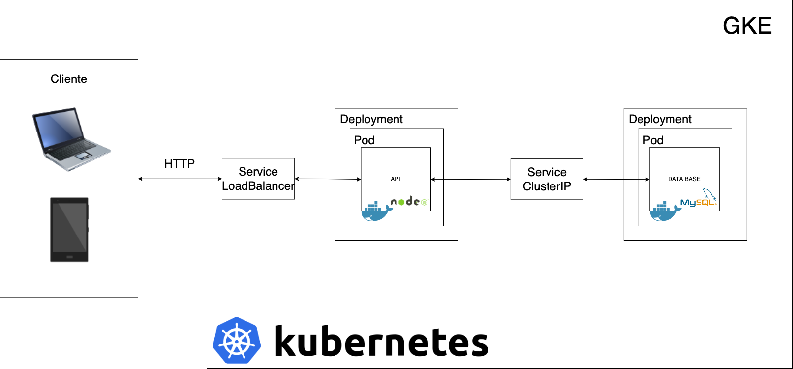

# K8s
Desplegando una backend en un cluster de kubernetes

## Recursos
- [ Grabación ](https://youtu.be/LTJ9JXwZpxU)
- [ Código ](/Code) 
- [ Test-Endpoints](/Collection-Postman) 

## Arquitectura 


### Comandos utilizados 
```sh
# Build de las imagenes
docker build -t racarlosdavid/mysql_gcpf_tarea3 .
docker build -t racarlosdavid/api_gcpf_tarea3 .

# Push al docker registry de las imagenes
docker push racarlosdavid/mysql_gcpf_tarea3
docker push racarlosdavid/api_gcpf_tarea3

# Para testear los containers de forma local 
docker run -d -p 3306:3306 --name mysql_gcpf_tarea3 racarlosdavid/mysql_gcpf_tarea3
docker exec -it mysql_gcpf_tarea3 mysql -u carlosdavid -p

docker run -d -p 2000:2000 --name api_gcpf_tarea3 racarlosdavid/api_gcpf_tarea3

# Creacion del cluster
gcloud config set compute/zone us-central1-a 
gcloud container clusters create cluster-k8s-conferencia --num-nodes=3

# Deployment
kubectl apply -f deployment.yml
kubectl delete -f deployment.yml
kubectl get services
kubectl get pods
kubectl rollout restart deployment/backend-deployment
```
